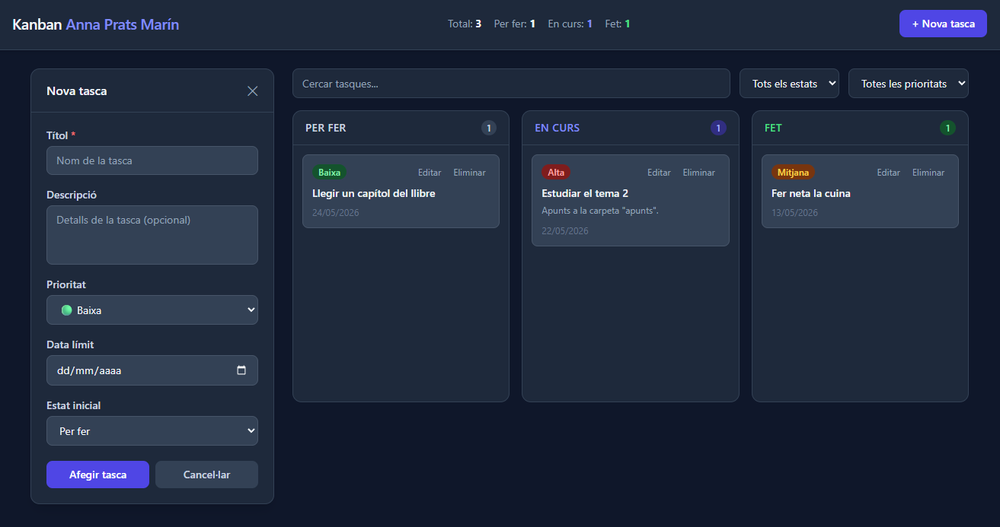

# Kanban amb drag & drop

Aplicació web de gestió de tasques tipus Kanban, desenvolupada com a pràctica de Desplegament d'Aplicacions Web. Permet organitzar tasques en columnes d'estat, cercar-les i filtrar-les. Les dades es guarden i persisteixen al navegador.

🔗 [Kanban Board - GitHub Pages](https://annapmarin.github.io/kanban-board/)

## Què permet fer?
* Crear tasques
* Editar i eliminar tasques existents
* Moure tasques entre columnes
* Filtrar per estat i prioritat
* Cercar per text (títol i descripció)
* Persistència automàtica al navegador amb `localStorage`



## Guia ràpida d'ús

### Crear una tasca
1. Clic al botó "+ Nova tasca" a la capçalera
2. Ompl el formulari
3. Selecciona l'estat inicial de la tasca
4. Clic a "Afegir tasca"

### Canviar l'estat d'una tasca
* Opció 1: arrosega la targeta a la columna del nou estat
* Opció 2: edita la targeta i canvia l'estat al formulari

### Filtrar i cercar
* Cerca tasques per títol o descripció i es filtraran automàticament a mesura que escriguis
* Selecciona un Estat o Prioritat i es filtraran les tasques que corresponguin
* Els filtres es combinen entre ells

## Estructura del projecte
```
kanban-board/
├── index.html
├── css/
│   └── style.css       ← Estils
├── js/
│   ├── script.js       ← Punt d'entrada 
│   ├── model.js        ← Model de la tasca
│   ├── storage.js      ← Persistència
│   ├── ui.js           ← Renderització i manipulació del DOM
│   ├── filtres.js      ← Lògica de filtrat i cerca
│   └── dragdrop.js     ← HTML Drag and Drop API
├── docs/               ← Documentació del procés per issues
└── README.md
```
